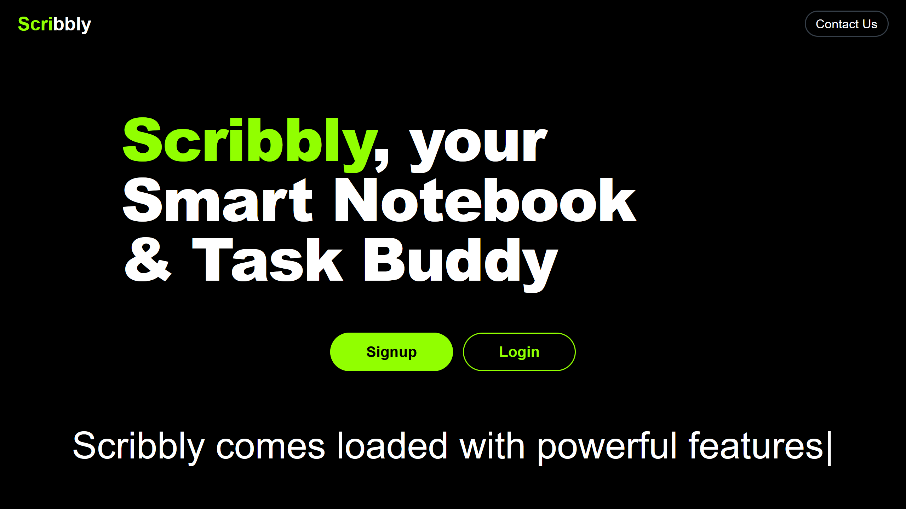
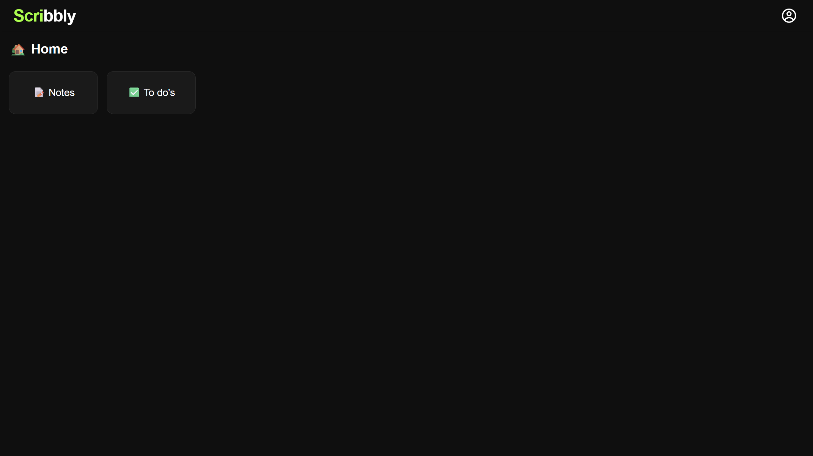
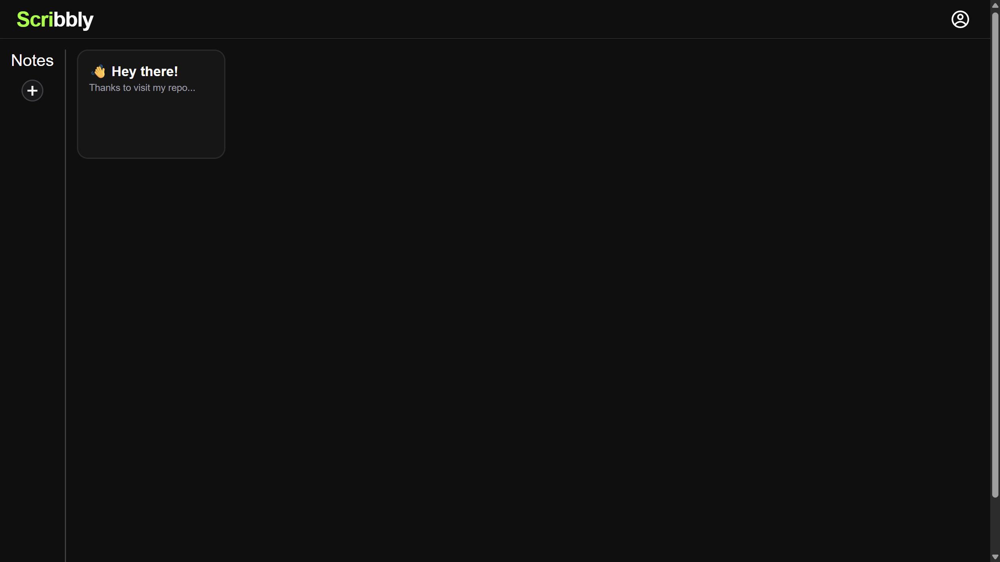
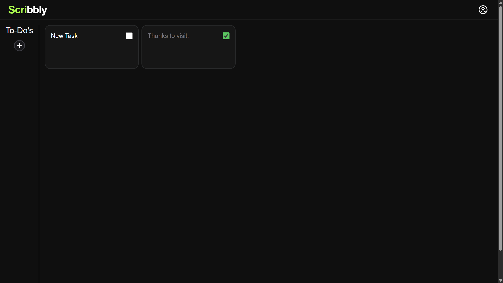
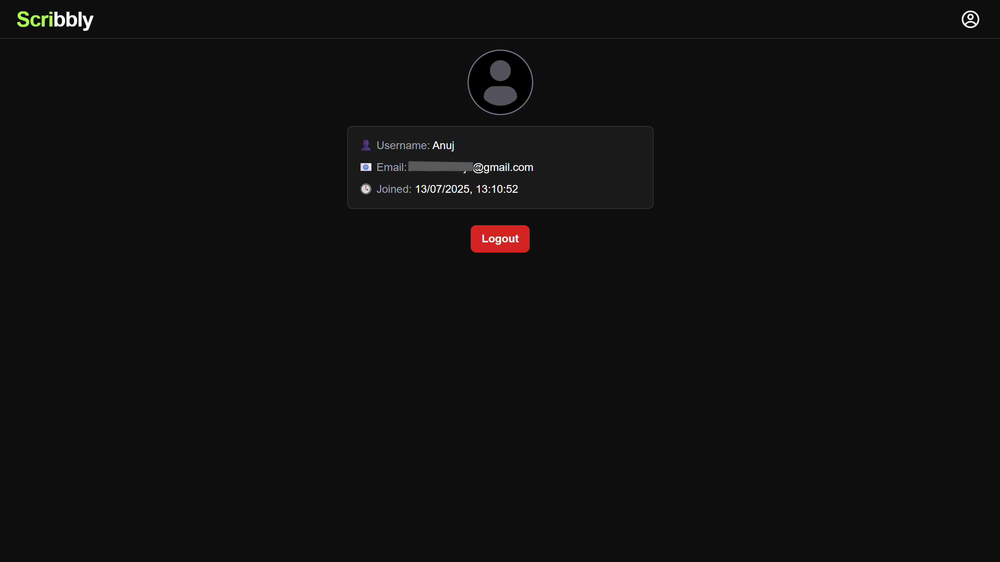

# 📝 Scribbly – A Notes & To-Do App

Scribbly is a modern, full-stack web application that lets you **create notes** and **manage to-dos** from anywhere. Built with **Next.js**, **TypeScript**, and **MongoDB**, it provides a responsive and secure experience across all devices.

---
### 🌐 Live Demo
Experience Scribbly in action:
https://scribbly.codzy.tech/

---

## 🚀 Features

✅ **User Authentication**  
Secure login to protect your personal notes and tasks.

✅ **Create & Access Notes Anywhere**  
Save rich text notes and access them across devices.

✅ **To-Do List with Check/Uncheck Support**  
Manage daily tasks with completion status and editing options.

✅ **Mobile-Friendly Design**  
Responsive layout works smoothly on mobile, tablet, and desktop.

✅ **Timestamps**  
Each note and task displays creation and last update time.

✅ **Secure Backend with Token-Based Auth**  
JWT-based authentication using secure cookies.

---

## 🛠️ Tech Stack

- **Frontend**: [Next.js](https://nextjs.org/) (App Router) with [TypeScript](https://www.typescriptlang.org/) and [Tailwind CSS](https://tailwindcss.com/)
- **Backend**: Next API routes (App Router's `route.ts`)
- **Database**: [MongoDB Atlas](https://www.mongodb.com/cloud/atlas) Cluster
- **Authentication**: JWT with secure cookies
- **UI Framework**: React, TailwindCSS

---

## 📷 Screenshots

#### 🛬 Landing Page  

#### 🏡 Home page

#### 📝 Notes page

#### 📃 Todo's page

#### 🙍 Profile page

---
